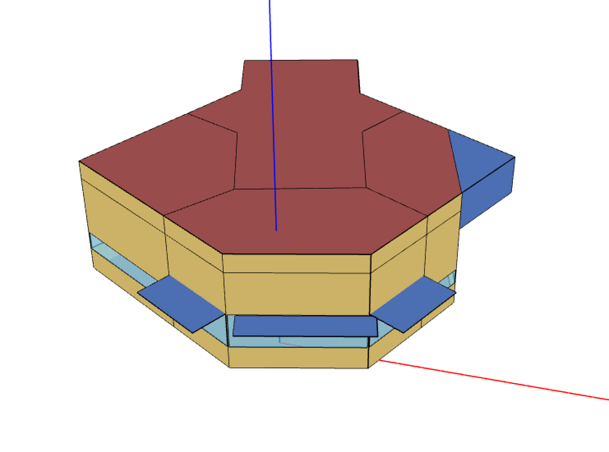

```{r setup, include=FALSE}
knitr::opts_chunk$set(echo = TRUE, warning = FALSE)
```

## Background

This calibration example showcases a Bayesian approach using the NREL site entrance building located in Colorado, USA, as the case study. The dataset and building model are sourced from the [NREL's Parametric Analysis Tool (PAT) GitHub Repository](https://github.com/NREL/OpenStudio-PAT/). The example is streamlined to concentrate on four calibration parameters, illustrating the Bayesian calibration process in a simplified context.
  
* Calibration Target/Observed Output: Electricity Usage (kWh)
* Observed Inputs:
    1. Outdoor Air Drybulb Temperature
    2. Outdoor Air Relative Humidity
* Calibration Parameters:
    1. Zone Infiltration Rate
    2. Electric Equipment Design Power
    3. Lighting Level
    4. AHU Fan Total Efficiency

This example employs EnergyPlus Version 23.1 and a suite of R packages essential for Bayesian calibration, data handling, and visualization:

```{r packages, message=FALSE}
library(here)       # Simplifies working with file paths.
library(eplusr)     # Facilitates interaction with EnergyPlus simulations.
library(knitr)      # Enables dynamic report generation in R Markdown.
library(decido)     # Provides tools for polygon geometry operations.
library(tidyverse)  # A collection of packages for data manipulation and visualization.
library(jsonlite)   # For working with JSON data.
library(lubridate)  # Makes date/time data manipulation easier.
library(lhs)        # Implements Latin Hypercube Sampling techniques.
library(rstan)      # Offers R interface to Stan for Bayesian inference.
library(viridis)    # Supplies color scales optimized for readability and aesthetics.
library(GGally)     # Extends ggplot2 for easy creation of complex plots like ggpairs.
library(ggplot2)    # Core package for creating plots in R.
```


An R script, `util.R`, contains utility functions designed to facilitate the calibration process.

```{r functions}
source(here("R", "util.R"))  # Load utility functions
```

## Parsing EnergyPlus into R

This section outlines the process for parsing the EnergyPlus model into R and interfacing with it through R programmatically. 

Firstly, define the paths to the necessary files:
* The EnergyPlus model (`seed.idf`).
* The corresponding weather file (`AMY_2013.epw`).

```{r}
idf_path <- here("data", "bayesian_calibration","seed.idf")
epw_path <- here("data", "bayesian_calibration","AMY_2013.epw")
```

Utilize the `eplusr` package to import the model and weather data into the R environment:
* `read_idf` loads the EnergyPlus model.
* `read_epw` loads the AMY weather file.

```{r}
idf_model <- read_idf(idf_path)
epw <- read_epw(epw_path)
```


## Visualize Weather Data

This section demonstrates the extraction and visualization of two weather parameters - dry bulb temperature and relative humidity - from the EnergyPlus weather file (EPW), observed inputs for the subsequent Bayesian calibration.

First, select and organize relevant weather data from the EPW object for analysis:

```{r}
weather_data <- epw$data() %>%
    select(datetime, dry_bulb_temperature, relative_humidity) %>%
    mutate(month = month(datetime, label = TRUE),
           day = day(datetime),
           wday = wday(datetime, label = TRUE),
           hour = hour(datetime))
```

Plot the dry bulb temperature to observe daily variations across different months:

```{r}
ggplot(weather_data, aes(x= hour, y = dry_bulb_temperature)) +
    geom_point(color = "#FCBBA1", alpha = 0.7, size = 0.5) +
    geom_smooth(color = "#EF3B2C") +
    facet_grid(cols = vars(month)) +
    xlab("Hour of the day") +
    ylab(expression("Dry bulb temperature " ( degree*C)))
```

Similarly, create a heatmap to display patterns of relative humidity over the course of the month:

```{r}
ggplot(weather_data, aes(x = day, y = hour, fill = relative_humidity)) +
    geom_tile() +
    scale_fill_viridis(name = "%",
                       option = "viridis") +
    facet_grid(cols = vars(month)) +
    ylab("Hour of the day") +
    xlab("Day of the week") 
```

## Preprocess the EnergyPlus Model

Before calibrating the model, the EnergyPlus model needs to be modified. This involves specifying outputs relevant to the calibration and their reporting intervals, ensuring the model aligns with the calibration's data requirements.

To align the EnergyPlus model with the specific requirements of our Bayesian calibration, we configure it to report on key outputs needed for the calibration. These outputs include electricity consumption as the primary calibration target and environmental conditions as observed inputs.
* Electricity Consumption: This is our calibration target, representing the total facility electricity usage. Monitoring this output allows us to assess the model's accuracy in simulating the building's energy consumption patterns.
* Dry Bulb Temperature and Relative Humidity: These environmental metrics serve as observed inputs, critical for contextualizing the energy usage data within the specific climate conditions experienced by the building.

```{r}
meters <- list(
    key_name = c(
        "Electricity:Facility"
    ),
    Reporting_Frequency = "Monthly"
)

variables <- list(
    key_value = "*",
    Variable_Name = c(
        "Site Outdoor Air Drybulb Temperature",
        "Site Outdoor Air Relative Humidity"
    ),
    Reporting_Frequency = "Monthly"
)
```


After defining these parameters, the `preprocess_idf` function, sourced from `util.R`, is employed to adjust the model accordingly. This function ensures that all prior settings for meters and variables are cleared and then reconfigures them according to our calibration needs. The preprocessed model is then saved under a new filename, `seed_preprocessed.idf`.


```{r, message=FALSE}
idf_model <- preprocess_idf(idf_model, meters, variables)
idf_model$save(here("data", "bayesian_calibration", "seed_preprocessed.idf"), 
               overwrite = TRUE)
```


## Metamodel Fitting for Calibration

### Generating Samples using Latin Hypercube Sampling

To streamline the calibration of EnergyPlus models, especially those characterized by complex geometries and large number of zones, we often resort to fitting metamodels. Metamodels are used to to model the behavior of the original EnergyPlus models but at significantly reduced computational cost, making them suitable for the iterative calibration processes.

For this example, we leverage the `lhs` package to generate samples through Latin Hypercube Sampling (LHS), a strategy designed to efficiently explore multi-dimensional spaces with a limited number of samples. To ensure the repeatability of our analysis, a fixed seed value (`set.seed(1)`) is set. For illustration purposes, the code below generates 30 simulation samples. Each sample represents a unique combination of parameter values, distributed across the parameter space to maximize coverage and minimize overlap:

```{r}
set.seed(1)

n_samples = 30
lhs_sample <- maximinLHS(n = n_samples, k = 4) %>%
    as.data.frame() %>%
    rename(fan_eff_frac = V1, 
           infil_frac = V2, 
           equip_frac = V3,
           light_frac = V4)

```

Here, we visualize the interactions between the generated samples to check for uniformity and spread of the samples across all four parameters, crucial for ensuring a robust metamodel fitting process. To capture the multidimensional nature of our samples, we employ a pairwise plot using the `ggpairs` function from the `GGally` R package to create a matrix of scatterplots for each pair of parameters, along with histograms showing the distribution of each parameter on the diagonal. 

```{r, message=FALSE}
ggpairs(lhs_sample) +
    theme_minimal()
```

### Running Parametric Simulations with Generated Samples

In this section, we utilize the energy simulation model to quantify the impact of varying the calibration parameters (based on the Latin HyperCube Samples) on the building's total electricity consumption. 

Prior to running the simulations, it is necessary to define functions capable of dynamically adjusting the calibration parameters within the model. The `run_param`` function defined below plays such a role in the process. We start by defining a function, `set_frac`, that modifies parameter values of a specific EnergyPlus object and field. Another function, `run_param`, uses `set_frac` to apply these adjustments across four calibration parameters: infiltration flow rate, AHU fan efficiency, electric equipment design power, and lighting power design level.

```{r}
set_frac <- function(idf, class_value, field_value, frac) {
     obj <- idf$to_table() %>%
        filter(class == class_value, field == field_value) %>%
        mutate(value = as.numeric(value) * frac)

    idf$update(obj)

    idf
}

run_param <- function(idf, fan_eff_frac, infil_frac, equip_frac, light_frac) {
    
    idf <- set_frac(idf,
                    "Fan:ConstantVolume",
                    "Fan Total Efficiency",
                    fan_eff_frac)

    idf <- set_frac(idf,
                    "ZoneInfiltration:DesignFlowRate",
                    "Flow Rate per Exterior Surface Area",
                    infil_frac)

    idf <- set_frac(idf,
                    "ElectricEquipment",
                    "Design Level",
                    equip_frac)
    
    idf <- set_frac(idf,
                    "Lights",
                    "Lighting Level",
                    light_frac)

    idf
}

```


With the functions defined, we use `param_job()` to initialize parametric simulations and apply_measure to apply the modifications. The simulations are configured to utilize the AMY weather file for 2013, ensuring that the environmental conditions are consistent across all scenarios

```{r, message=FALSE}
param_model <- param_job(idf_model, epw)

param_model$apply_measure(run_param,
                          fan_eff_frac = lhs_sample$fan_eff_frac,
                          infil_frac = lhs_sample$infil_frac,
                          equip_frac = lhs_sample$equip_frac,
                          light_frac = lhs_sample$light_frac,
                          .names = c(paste0("bc_", 1:n_samples)))


```

The following code snippet uses the `$cases()` method to extract and display a summary of the parameter values alongside their corresponding model identifiers. 

```{r}
param_model$cases()
```

With everything set up, the simulations are run using the `$run` method. This step iterates through the defined LHS samples, applying each set of parameter adjustments to the base model.

```{r, message=FALSE}
param_model$run(dir = tempdir())
```


### Comparing Generated Samples with Actual Measurements

First, we collate the relevant outputs from the parametric simulations, adjusting units as necessary to align with the actual data:

```{r}
datacomp <- param_model$report_data(year = 2013,
                                    tz = "America/Denver") %>%
    mutate(datetime = datetime %m-% months(1),
           value = ifelse(units == "J", value * 2.77778e-7, value),
           units = ifelse(units == "J", "kWh", units)) %>%
    unite(name, name, units, sep = "_") %>%
    select(case, datetime, name, value) %>%
    pivot_wider(
        names_from = name,
        values_from = value
    )
```


Next, we incorporate actual electricity usage data from `actual_electric.json`, ensuring it matches the format and timezone of the simulation data:

```{r}
datafield <- fromJSON(here("data", "bayesian_calibration", "actual_electric.json")) %>%
    as.data.frame() %>%
    mutate(datetime = ymd_hms(`data.from`),
           datetime = force_tz(datetime, tz = "America/Denver"),
           year = lubridate::year(datetime),
           `Electricity:Facility_kWh` = data.tot_kwh,
           case = "actual") %>%
    filter(year == 2013) %>%
    select(datetime, `Electricity:Facility_kWh`, case) 

```

Finally, we visually compare the simulated electricity usage against actual measurements. The objective is to visually ensure that the measurements are within the range of the simulated results.

```{r}
datacomp_output <- select(datacomp, datetime, `Electricity:Facility_kWh`, case)

data_combined <- bind_rows(datafield, datacomp_output) %>%
    mutate(case = if_else(case != "actual", "simulated", case),
           month = lubridate::month(datetime, label = TRUE))

ggplot(data_combined, aes(x = month, y= `Electricity:Facility_kWh`, 
                          color = case, group = case)) +
    geom_point(size = ifelse(data_combined$case == "actual", 2, 0.8)) +
    scale_color_brewer(palette = "Set2") +
    labs(x = "Month in 2013", y = "Electricity:Facility (kWh)", color = "") +
    theme_minimal()

```

## Bayesian Calibration

In this section, we delve into the specifics of setting up and executing Bayesian calibration using `Stan`, a platform for statistical modeling.

### Executing Bayesian Calibration using Stan

First, we define the necessary inputs, calibration parameters, and observed outputs, preparing them for the calibration process:

```{r}
# Setting simulation output, input, and calibration parameters
eta <- datacomp$`Electricity:Facility_kWh`
xc <- datacomp %>%
    select(`Site Outdoor Air Drybulb Temperature_C`, `Site Outdoor Air Relative Humidity_%`)
tc <- lhs_sample %>%
    slice(rep(row_number(), each = nrow(datacomp)/nrow(lhs_sample)))

# Setting observed output and corresponding inputs
y <- datafield$`Electricity:Facility_kWh`
xf <- xc[1:length(y),]

# Getting dimensions of respective data
p <- ncol(xc)  # number of input factors
q <- ncol(tc)  # number of calibration parameters
n <- length(y)  # sample size of observed field data
m <- length(eta)  # sample size of computer simulation data

```

Before running the Bayesian calibration in Stan, it's essential to standardize the simulation and observed outputs. This standardization, or Z-score normalization, adjusts the data to have a mean of 0 and a standard deviation of 1:

```{r}
# Standardizing simulation and observed outputs
eta_mu <- mean(eta, na.rm = TRUE)  # Calculating the mean value of simulation outputs
eta_sd <- sd(eta, na.rm = TRUE)  # Calculating the standard deviation
y <- (y - eta_mu) / eta_sd  # Standardizing observed outputs
eta <- (eta - eta_mu) / eta_sd  # Standardizing simulation outputs
```

We apply min-max normalization to input factors so that the values are in the range `[0, 1]`. Note that we do not apply the same normalization to the calibration parameters because being fractions, they are already in the `[0, 1]` range.

```{r}
# Apply standardization and normalization
x <- rbind(as.matrix(xf), as.matrix(xc))
for (i in 1:ncol(x)) {
    x_min <- min(x[, i], na.rm = TRUE)
    x_max <- max(x[, i], na.rm = TRUE)
    xf[, i] <- (xf[, i] - x_min) / (x_max - x_min)
    xc[, i] <- (xc[, i] - x_min) / (x_max - x_min)
}

```


With data standardized and normalized, we structure it for Stan, configuring parallel processing to improve efficiency:

```{r}
# Prepare data for Stan
stan_data <- list(n = n, m = m, p = p, y = y, q = q, eta = eta, 
                  xf = as.matrix(xf), xc = as.matrix(xc), tc = as.matrix(tc))

# Parallel processing configuration
rstan_options(auto_write = TRUE)
options(mc.cores = parallel::detectCores())
```

The Bayesian calibration model is executed in Stan. Note that the code will took approximately 10 minutes to run on my computer (Apple MacBook Pro, M1 Max chip, 64GB memory).

```{r, message=FALSE}
fit <- stan(file = here("R", "bcWithoutPred.stan"), 
            data = stan_data, 
            iter = 500, 
            chains = 3)
```

After Stan completes its computations, we examine the calibration parameters through traceplots and posterior distributions, offering insights into their convergence and the calibration's overall performance:

```{r}
# Traceplots for calibration parameters
stan_trace(fit, pars = c("tf"))

# Posterior distributions
stan_dens(fit, pars = c("tf"))

```

### Extracting and Summarizing Posterior Samples

we now extract the posterior samples (excluding warm-up sample) to ensure we're working with converged results:

```{r}
# Extract posterior samples
samples <- rstan::extract(fit)
```

Calculating mean values and standard deviations for each calibration parameter provides a quantitative summary of their posterior distributions:

```{r}
# Compute summary statistics for calibration parameters
tf <- samples$tf %>%
    as.data.frame() %>%
    rename(
        fan_eff_frac = V1,
        infil_frac = V2,
        equip_frac = V3,
        light_frac = V4
    )

# Calculate mean and spread (standard deviation)
summary_stats <- sapply(tf, function(x) c(mean = mean(x), sd = sd(x)))
kable(summary_stats)
```

To further interpret the calibration parameters, we visualize their distributions. This helps identify the range and concentration of values for each parameter, providing a clearer understanding of their distribution:

```{r}
# Convert calibration parameters data frame to long format for visualization
tf_long <- tf %>%
    pivot_longer(cols = everything()) 

# Create histograms for each calibration parameter
ggplot(tf_long, aes(x = value)) +
    geom_histogram(fill = "#66c2a5", alpha = 0.5, bins = 10) +
    facet_grid(cols = vars(name)) +
    labs(x = "Values", y = "Frequency") +
    theme_minimal()

```


## Compare Calibrated Simulation results with Actual Measurements

This section focuses on parsing the calibrated parameters into the EnergyPlus model. By comparing the results of these calibrated simulations against actual measurements, we evaluate the calibration's effectiveness in enhancing the model's predictive accuracy.

To simplify our example and facilitate illustration, we sample (with replacement) 50 sets of calibration parameters from the posterior distribution. These samples represent a range of plausible parameter sets informed by the Bayesian calibration process. To ensure reproducibility, we use a seed value of 2 (`set.seed(2)`).

```{r}
# Sampling from posterior distribution
set.seed(2)
n_posterior <- 200
sampled_tf <- tf %>%
    sample_n(size = n_posterior, replace = TRUE)
```

With the sampled parameter sets, we initialize a new series of EnergyPlus parametric simulations. Each set of parameters is used to modify the model, with the objective to explore the range of calibrated outcomes:

```{r, message=FALSE}
# Initialize parametric model with posterior samples
param_model_calibrated <- param_job(idf_model, epw)

# Apply calibration parameters to the model
param_model_calibrated$apply_measure(run_param, 
                                     fan_eff_frac = sampled_tf$fan_eff_frac,
                                     infil_frac = sampled_tf$infil_frac,
                                     equip_frac = sampled_tf$equip_frac,
                                     light_frac = sampled_tf$light_frac,
                                     .names = c(paste0("bc_calibrated_", 1:n_posterior)))

# Summary of configured simulation cases
param_model_calibrated$cases()
```

With the EnergyPlus model configured with the posterior samples, we proceed to run the EnergyPlus simulations:

```{r, message=FALSE}
# Execute the calibrated simulations
param_model_calibrated$run(dir = tempdir())
```


After running the EnergyPlus simulation with the posterior samples, we extract the simulation results, combining them with actual measurements, evaluating the calibration's accuracy through statistical metrics (CVRMSE and NMBE), and visualizing the comparison between measured data and simulated predictions.

First, we extract the calibrated simulation results setting the year to be similar to the measured data, and converting energy units where necessary and reshaping the data for analysis:

```{r}
calibrated_results <- param_model_calibrated$report_data(year = 2013,
                                    tz = "America/Denver") %>%
    mutate(datetime = datetime %m-% months(1),
           value = ifelse(units == "J", value * 2.77778e-7, value),
           units = ifelse(units == "J", "kWh", units)) %>%
    unite(name, name, units, sep = "_") %>%
    select(case, datetime, name, value) %>%
    pivot_wider(
        names_from = name,
        values_from = value
    ) %>%
    select(datetime, `Electricity:Facility_kWh`, case)
```

This data is then combined with the actual electricity usage data (`datafield`), distinguishing between actual and simulated cases:

```{r}
results_combined <- bind_rows(datafield, calibrated_results) %>%
        mutate(case = if_else(case != "actual", "simulated", case),
           month = lubridate::month(datetime, label = TRUE))
```

We calculate the Coefficient of Variation of Root Mean Squared Error (CV(RMSE)) and the Normalized Mean Bias Error (NMBE) to quantitatively assess the calibration's accuracy:

```{r}
# Calculating mean simulated electricity usage by month
y_pred_mu <- results_combined %>%
    filter(case == "simulated") %>%
    group_by(month) %>%
    summarise(`Electricity:Facility_kWh` = mean(`Electricity:Facility_kWh`))

# Computing CV(RMSE) and NMBE
cvrmse = cvrmse(y_pred_mu$`Electricity:Facility_kWh`, datafield$`Electricity:Facility_kWh`)
nmbe = nmbe(y_pred_mu$`Electricity:Facility_kWh`, datafield$`Electricity:Facility_kWh`)

print(paste("CV(RMSE) =", cvrmse, "%"))
print(paste("MBE =", nmbe, "%"))

```


We also create a plot to visually compare the measured data with the simulated predictions, using box plots to represent the range of simulated outcomes and points to denote the actual measurements:

```{r}
# Preparing data for visualization
datafield <- datafield %>%
    mutate(month = month(datetime, label = TRUE))

y_pred <- results_combined %>%
    filter(case == "simulated") %>%
    group_by(month)

# Plotting the comparison
ggplot() +
    geom_boxplot(data = y_pred, aes(x = month, y = `Electricity:Facility_kWh`), 
                 outlier.size = 0.2, color = "#66c2a5") +
    geom_point(data = datafield, aes(x = month, y = `Electricity:Facility_kWh`), 
               color = "#fc8d62") +
    labs(x = "Month in 2013", y = "Electricity:Facility (kWh)") +
    theme_minimal()

```

## Simulating Energy Conservation Measures (ECMs)

Leveraging the uncertainties quantified through Bayesian calibration, we explore the potential energy savings from implementing ECMs. In this scenario, we consider the effects of reducing equipment power by 30% and upgrading the AHU fan to a model with a total efficiency of 0.7.

To simulate these conservation measures, we define functions that directly adjust the specified parameters within the EnergyPlus model:

```{r}

# Function to set specific values for model parameters
set_value <- function(idf, class_value, field_value, value){
     obj <- idf$to_table() %>%
        filter(class == class_value, field == field_value) %>%
        mutate(value = value)

    idf$update(obj)

    idf
}

# Function to apply ECMs by setting and reducing values
run_ecm <- function(idf, fan_eff_value, infil_frac, equip_frac, light_frac) {
    
    idf <- set_value(idf,
                    "Fan:ConstantVolume",
                    "Fan Total Efficiency",
                    fan_eff_value)

    idf <- set_frac(idf,
                    "ZoneInfiltration:DesignFlowRate",
                    "Flow Rate per Exterior Surface Area",
                    infil_frac)

    idf <- set_frac(idf,
                    "ElectricEquipment",
                    "Design Level",
                    equip_frac)
    
    idf <- set_frac(idf,
                    "Lights",
                    "Lighting Level",
                    light_frac)


    idf
}

```


With the ECM functions defined, we adjust the posterior samples to reflect a 30% reduction in equipment power levels, maintaining all other parameter values to represent the calibrated model's quantified uncertainties:

```{r}
# Adjust equipment power levels in posterior samples
sampled_tf_ecm <- sampled_tf %>%
    mutate(equip_frac = equip_frac * 0.7)
```

We then configure a new set of parametric simulations within the EnergyPlus model to assess the impact of these ECMs:

```{r, message=FALSE}
# Initialize calibrated model for ECM simulation
param_model_calibrated_ecm <- param_job(idf_model, epw)

# Apply ECM adjustments to the model. Note that fan efficiency is set to 0.7.
param_model_calibrated_ecm$apply_measure(run_ecm, 
                                         fan_eff_value = 0.7,
                                         infil_frac = sampled_tf_ecm$infil_frac,
                                         equip_frac = sampled_tf_ecm$equip_frac,
                                         light_frac = sampled_tf_ecm$light_frac,
                                         .names = c(paste0("bc_calibrated_ecm_", 1:n_posterior)))

```

The EnergyPlus simulations configured with the ECMs are then executed to evaluate the ECMs' impact using the calibrated energy simulation model (with quantified uncertainties).

```{r, message=FALSE}
# Run the ECM simulations
param_model_calibrated_ecm$run(dir = tempdir())
```


## Visualizing Energy Savings from ECMs

In this final part, we focus on illustrating the energy savings (with quantified uncertainties) achieved through the implementation of Energy Conservation Measures (ECMs) in the calibrated EnergyPlus model. 

First, we extract the annual total electricity end use from both the base case simulations and the ECM-applied simulations. This step converts energy values to a consistent unit (kWh) for accurate comparison:

```{r}
# Extracting results for the base case
results_base <- param_model_calibrated$tabular_data() %>%
    filter(report_name == "AnnualBuildingUtilityPerformanceSummary",
           table_name == "End Uses",
           column_name == "Electricity",
           row_name == "Total End Uses") %>%
    mutate(value = as.numeric(value),  # Convert value to numeric
           value = ifelse(units == "GJ", value * 277.778, value),  # Conversion to kWh if needed
           units = ifelse(units == "GJ", "kWh", units),  # Update units
           case = "base")

# Extracting results for the ECM case
results_ecm <- param_model_calibrated_ecm$tabular_data() %>%
    filter(report_name == "AnnualBuildingUtilityPerformanceSummary",
           table_name == "End Uses",
           column_name == "Electricity",
           row_name == "Total End Uses") %>%
    mutate(value = as.numeric(value),  # Convert value to numeric
           value = ifelse(units == "GJ", value * 277.778, value),  # Conversion to kWh if needed
           units = ifelse(units == "GJ", "kWh", units),  # Update units
           case = "ecm")

```

Here, we compare the annual total electricity end uses between the base case and the ECM case. This comparison quantifies the effectiveness of the ECMs in reducing energy consumption. We visualize this comparison using a density plot, with mean values highlighted to illustrate the shift in energy consumption:

```{r}
# Binding results for visualization
plot_results <- bind_rows(results_base, results_ecm) %>%
    select(case, value)

# Calculating mean values for annotation
mean_values <- plot_results %>%
    group_by(case) %>%
    summarise(mean_value = mean(value, na.rm = TRUE)) %>%
    mutate(label = paste("mean =", round(mean_value, 0), "kWh"))

# Creating the density plot with mean value annotations
ggplot(plot_results, aes(x=value, fill=case)) + 
    geom_density(aes(color = case), alpha = 0.2) +
    scale_fill_manual(values = c("base" = "#E78AC3", "ecm" = "#8DA0CB")) +
    scale_color_manual(values = c("base" = "#E78AC3", "ecm" = "#8DA0CB")) +
    geom_vline(data = mean_values, aes(xintercept = mean_value, color = case), linetype = "dotted", size = 1) +
    geom_text(data = mean_values, aes(x = mean_value, y = 0.000085, label = label, color = case), 
              hjust = 0, vjust = -0.5, angle = 90) +
    theme_minimal() +
    labs(x = "Total electricity end uses (kWh)", y = "Density")

```

To further evaluate the effectiveness of the implemented ECMs on electricity consumption, the following code provides summary statistics for the ECM case. The summary statistics includes reporting the mean, median, standard deviations, and percentile ranges. 

```{r}
# Calculate and Round Summary Statistics for the ECM Case
ecm_summary_stats <- plot_results %>%
    group_by(case) %>%
  summarise(
    Mean = round(mean(value, na.rm = TRUE)),
    Median = round(median(value, na.rm = TRUE)),
    SD = round(sd(value, na.rm = TRUE)),
    IQR = round(IQR(value, na.rm = TRUE)),
    Min = round(min(value, na.rm = TRUE)),
    Max = round(max(value, na.rm = TRUE)),
    `25th Percentile` = round(quantile(value, 0.25, na.rm = TRUE)),
    `75th Percentile` = round(quantile(value, 0.75, na.rm = TRUE))
  ) 

# Display the Rounded Summary Statistics with Units using kable
knitr::kable(ecm_summary_stats, caption = "Summary Statistics in kWh (Nearest Integer)")


```


